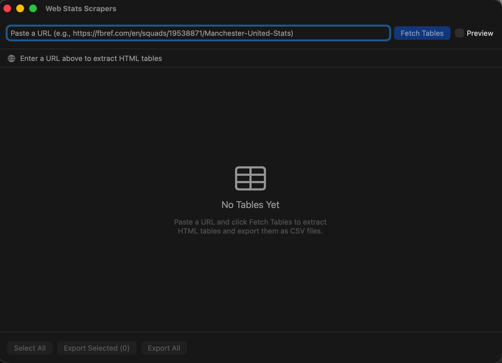
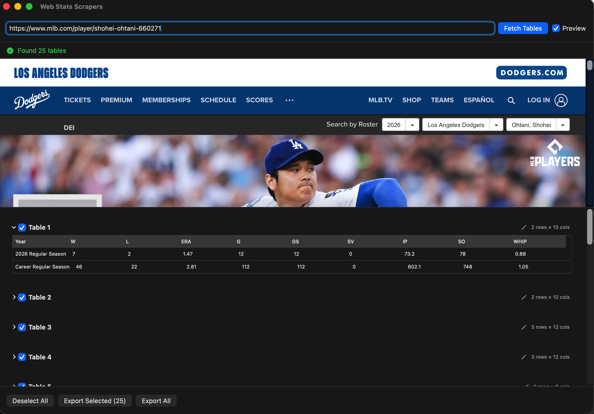

# Web Stats Scraper

A native macOS app that pulls HTML tables off any web page and exports them as **CSV or Excel (.xlsx)** — no Python, no Beautiful Soup, no code. Paste a URL, click **Fetch Tables**, pick the tables you want, and save them as spreadsheets.

Built for getting to data quickly: sports stats, reference tables, anything rendered as an HTML `<table>`.

## Have you ever…

…tried to copy a nice clean table off a website into Excel, only to watch it paste as one cursed column of mush with everything jammed together? 😩

…decided to "do it properly" with Python and Beautiful Soup — then spent 45 minutes installing things, 20 more fighting `pip` errors, discovered the table loads with JavaScript so your scraper sees nothing, and finally just… retyped all the numbers by hand like it's 1997?

…highlighted a table, pressed ⌘C, closed your eyes, and *prayed*?

Yeah. Same. **That's why this exists.** Paste the URL, click a button, get your CSV. No mush, no `pip`, no praying.

## Who it's for

This is for the **data analyst (or student, researcher, or hobbyist) who just wants the data** — fast, without writing or debugging scraping code.

If you've ever fought with Beautiful Soup just to grab a single table — installing Python, inspecting the page source, figuring out the right selectors, handling JavaScript-rendered content — this is the friendly alternative. Paste a URL, click a button, get a CSV. No setup, no code, no terminal.

It's especially handy if you:

- Pull numbers from the same kinds of pages often (sports stats, league tables, reference data)
- Want the result straight into Excel or a spreadsheet for analysis
- Prefer pointing and clicking over scripting

It is **not** meant to be an industrial-scale scraping framework. For one-off and everyday "I just need this table" jobs, that's exactly the point.

## Screenshots

| Paste a URL to start | Tables extracted with detected names, ready to export |
| --- | --- |
|  |  |

## How it works

Instead of downloading raw HTML and parsing it (the Beautiful Soup approach), the app loads the page in a real browser engine (`WKWebView`), lets the page's JavaScript run, and then reads the tables straight out of the rendered DOM. This means it handles modern sites that build their tables with JavaScript after the page loads — which trips up traditional scrapers.

## Features

- **Paste a URL and fetch** — extracts every meaningful `<table>` on the page
- **Live preview** — see each table's columns and rows before exporting
- **Pick what you want** — checkboxes per table, plus a **Select All / Deselect All** toggle
- **Rename tables** — double-click a title to give the export a sensible filename
- **CSV export** — RFC 4180–compliant, one file per table
- **Excel export** — a single `.xlsx` workbook with one sheet per table; opens cleanly on Mac and Windows
- **Choose where it lands** — pick a destination folder when you export
- **Safe saves** — never overwrites an existing file (adds a numeric suffix instead)
- **Optional web preview** — toggle a live view of the page while it loads

## Built with

- **Swift** — the language the entire app is written in
- **SwiftUI** — the user interface (URL bar, table list, preview, export controls)
- **JavaScript** — a small script injected into the loaded page to read tables out of the rendered DOM
- **WebKit (`WKWebView`)** — the embedded browser engine that loads pages and runs their JavaScript
- **AppKit / Foundation** — macOS system integration (windowing, file saving)

In short: a native Swift/SwiftUI macOS app, with a touch of JavaScript doing the actual table extraction inside the page.

## Energy & resource use

Being a native app, the footprint is **very low**:

- **It only works when you do.** Real effort happens during a fetch — load the page, run its JavaScript, read the tables. The rest of the time the app just sits there, using next to nothing.
- **No background processes.** No servers, daemons, syncing, or phone-home — nothing runs when the app is closed.
- **No heavyweight runtimes.** It uses the browser engine already built into macOS (`WKWebView`) rather than bundling its own copy of Chromium (like an Electron app) or spinning up a Python environment. That means a smaller download, less memory, and lighter CPU use.
- **The one brief spike** is while a page loads — the same work your normal browser does when you open that page — and it settles right back down once the tables are extracted.

Practically: lighter on your battery and fans than keeping a browser full of tabs open to copy tables by hand.

## Requirements

- macOS (Apple Silicon or Intel)
- Xcode (to build from source)

## Building

1. Open `Web Stats Scraper.xcodeproj` in Xcode
2. Select the **Web Stats Scraper** scheme
3. Build and run (⌘R)

## Usage

1. Paste a URL into the field at the top (e.g. a stats or reference page)
2. Click **Fetch Tables** and wait for the page to load and render
3. Review the tables that were found in the preview list
4. Check the ones you want, optionally rename them
5. Click **Export CSV** or **Export Excel** and choose a destination folder

## CSV or Excel? (and a note for Excel-for-Mac users)

Both formats hold the same data — the difference is how cleanly they *open*, especially in **Excel for Mac**.

**The Excel-for-Mac quirk:** a `.csv` is just text with commas, so Excel has to *guess* where the columns are when you double-click it. Excel for Windows guesses correctly (it uses your system's list separator). **Excel for Mac often guesses wrong** and dumps the whole row into a single column — the "cursed column of mush." That's a long-standing Excel-for-Mac limitation, not a problem with the file.

Ironically, **Apple's own Numbers opens the very same CSV perfectly** — columns split cleanly, no fuss — as does Google Sheets. So it's specifically *Microsoft's* Excel for Mac that trips over a plain-text file that everything else (including Excel for Windows) reads just fine. 🤷

A `.xlsx`, by contrast, stores every value in an **explicitly defined cell** — there's no delimiter to guess. So it opens with columns intact, identically, everywhere.

**Which should you pick?**

| Use… | When |
| --- | --- |
| **Excel (.xlsx)** | You're on **Excel for Mac**, or want it to "just open" correctly everywhere with no fuss. Also nicer when exporting several tables — they arrive as separate tabs in one workbook. |
| **CSV** | You're feeding the data into code/tools (pandas, R, databases), opening in **Numbers or Google Sheets**, or want a plain-text file you can diff or script against. |

**If you already have a CSV that opened as one column in Excel for Mac:** you don't need to re-export — just select column A and use **Data → Text to Columns → Delimited → Comma**, or open it via **Data → Get Data → From Text (CSV)**. Or simply export it as Excel instead.

**Short version:** on a Mac, reach for **Excel (.xlsx)** when you just want to look at the data, and **CSV** when something else is going to read it.

## Bot checks & the Preview toggle

Some sites (Cloudflare-protected pages like FBref, and others with anti-bot
protection) put up a challenge — a "Verifying you are human" / "Just a moment…"
screen — before the real page loads. When that happens, the app may find no
tables, or only the challenge page's content.

The fix is the **Preview** checkbox in the top-right:

1. Turn on **Preview** to show the live web page while it loads.
2. Click **Fetch Tables**. If a bot check appears, complete it in the preview
   (e.g. tick the "I'm human" box) just like you would in a normal browser.
3. Once the real page finishes loading, the tables will be extracted.

Because the app uses a real browser engine (`WKWebView`), these challenges
behave exactly as they do in Safari — so passing them once in the preview lets
the page through. Leaving Preview on is the simplest way to handle any site
that occasionally throws up a verification step.

## Project structure

| File | Purpose |
| --- | --- |
| `ContentView.swift` | The SwiftUI interface — URL bar, table list, preview, export |
| `WebViewFetcher.swift` | Loads the page in `WKWebView` and extracts tables from the DOM |
| `CSVExporter.swift` | Turns extracted tables into CSV and saves them to disk |
| `XLSXExporter.swift` | Builds a multi-sheet `.xlsx` workbook (dependency-free OOXML + ZIP writer) |
| `Models.swift` | Data models for parsed tables and fetch state |

## Quirks & limitations

It's a handy tool, not a magic wand — and it has its quirks. Expect to give some exports **a little cleanup** once they land in your spreadsheet:

- **Some tables need a light tidy.** Stray footnote markers, icons, or odd spacing can ride along in a cell. Usually a quick find-and-replace in Excel sorts it out.
- **Table names are best-guess.** The app sniffs out a title from nearby headings and labels, but when a page gives it nothing to work with, you'll get a generic "Table 3." (You can rename any table before exporting.)
- **Column splitting isn't perfect.** Tables with merged cells, multi-row headers, or unusual layouts may come out slightly misaligned.
- **JavaScript-heavy / protected sites can be fussy.** Pages behind bot checks may need the **Preview** toggle (see above), and very dynamic pages occasionally need a second fetch.
- **It only sees real tables.** If a site fakes a table with plain `
`s and styling, there's nothing for the app to grab.

None of this is a dealbreaker for everyday "I just need this table" jobs — it just means the occasional export benefits from a 30-second polish before you call it done.

## Notes

This is a personal tool, built for quick, friendly table extraction rather than as a general-purpose scraping product. It works best on pages where the data lives in real HTML `<table>` elements.
